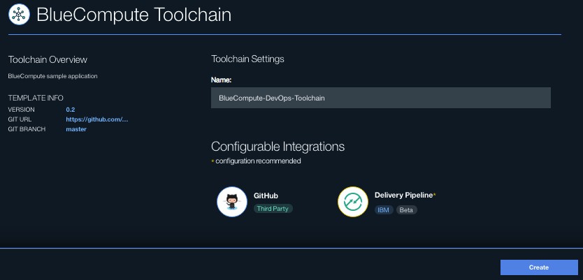
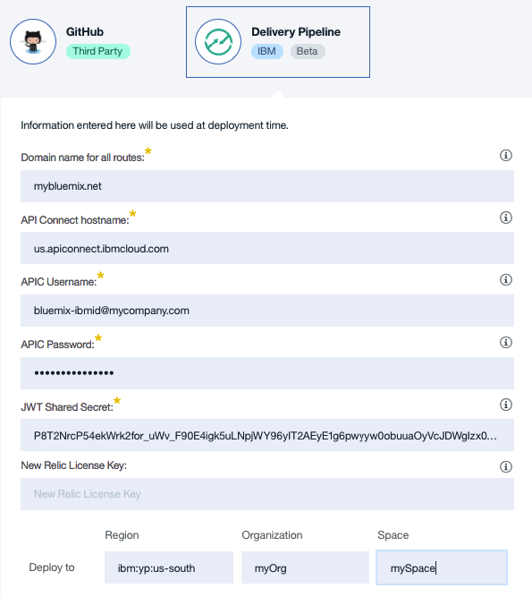
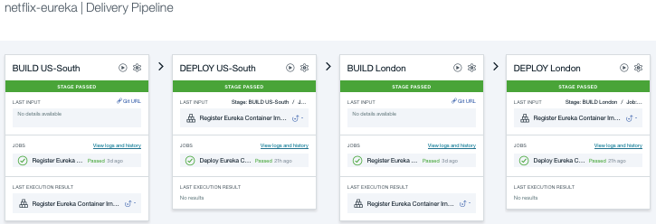

# DevOps for Cloud Native Reference Application

*This project is part of the 'IBM Cloud Native Reference Architecture' suite, available at
https://github.com/ibm-cloud-architecture/refarch-cloudnative*

## Introduction

DevOps, specifically automated Continuous Integration and Continuous Deployment (CI/CD), is important for Cloud Native Microservice style application. This project is developed to demonstrate how to use tools and services available on IBM Bluemix to implement the CI/CD for the BlueCompute reference application.

The project uses [Bluemix DevOps open toolchains](https://new-console.ng.bluemix.net/docs/toolchains/toolchains_overview.html) to implement the CI/CD. The goal is to standup most of the application components as part of an automated pipeline. So you don't have to go through the manual setup as outlined in the project main repository page. The toolchain for BlueCompute application looks like this:

  

To read more about the Open Toolchains, please check out this [Blog post](https://developer.ibm.com/devops-services/2016/06/16/open-toolchain-with-ibm-bluemix-devops-services/)

Let's get started.

## Setup BlueCompute application using Bluemix DevOps open toolchain

Bluemix DevOps toolchain provided with this application integrates the source code in git repositories with deployment scripts to continuously deliver code changes to staging and production applications.

To demonstrate hybrid connectivity, the inventory microservice in BlueCompute application is setup to connect to a MySQL cluster in US and London regions. Setup Vyatta network gateway appliances in SoftLayer US and London regions, and then setup MySQL servers in both regions.

### Prerequisites

You need to have a Bluemix account. Login to your Bluemix account or register for a new account [here](https://bluemix.net/registration)

Once you have logged in, create a new space for hosting the application in US-South and London regions. Use the same space name in both regions.

### Step 1: Setup VPN Tunnel and MySQL servers in SoftLayer

See [VPN and MySQL instructions](https://github.com/ibm-cloud-architecture/refarch-cloudnative-resiliency/blob/master/mysql/README.md#set-up-vpn-tunnel-between-bluemix-and-on-premise-resources) to setup on-premise MySQL server accessible from Bluemix service over a VPN tunnel.

After setting up the vpn tunnel and MySQL servers, get following information to set in toolchain configuration.

||US-South|London|
|---|---|---|
|Vyatta Gateway Address|||
|VPN Pre-shared Key|||
|Subnet with MySQL servers|||
|MySQL server addresses|ipaddr:port[,ipaddr:port]..|||

### Step 2:  Provision the API Connect Service

1. Click on the Bluemix console and select API.  
2. Select the API Connect service.  
3. Click "Create" in the Getting Started with API Connect page. In API Connect creation page, specify the Service name for example cloudnative-apic-service. Then select the Essentials plan for this walkthrough.
4. After the API Connect service is created, launch the API Connect service.  
5. In the API Manager page, navigate to the API Connect Dashboard and select "Add Catalog" at the top left. You may notice that a sandbox has automatically been generated for you.  
6. Name the catalog "**BlueCompute**" and press "Add".
7. Select the catalog and then navigate to the Settings tab and click the Portal sub-tab.
8. To setup a Developer Portal that your consumers can use to explore your API, select the IBM Developer Portal radio button. Then click the "Save" button to top right menu section. This will
provision a portal for you. You should receive a message like the one below. 
9. Once the new Developer Portal has been created, you will receive an email.

### Step 3: Create the Bluemix DevOps toolchain
Click the following button to deploy the toolchain to Bluemix. The Bluemix DevOps runtime will parse the toolchain template file that creates and integrates GitHub repos and Continuous Delivery pipelines to deploy to a targetted space in US-South and London Bluemix regions.

1. Enter toolchain name in the **Name:** field. 
2. By default, the **GitHub** integration is configured to clone the associated git repos to your GitHub account. Click on **GitHub** integration to see the list of repos that are setup to clone to your account.
3. Click on **Delivery Pipeline** integration to do the configuration. 
4. By default the Bluemix Organization, and Space information will be filled with the logged in Region, Organization, and Space values. Double-check to ensure this is the desired Region, Organization, and Space this toolchain should deploy to and update __Region__, __Organization__, and __Space__ values accordingly.
5. Enter __Customer Gateway__, __Customer Subnet__, __VPN Preshared key__, and __Onprem MySQL server__ addresses for both US-South and London regions based on information collected in Step 1.
6. Enter __IBMid Username__ and __Password__. These are Bluemix credentials, which are IBMid username and password with administrative access to API Developer Portal in the corresponding Bluemix space.
7. Go to [JSON Web Key Generator](https://mkjwk.org/#shared). Switch to __Shared Secret__ tab, set __Key Size: 2048__, __Key Use: Signing__, __Algorithm: HS256__ and click on __New Key__ button. Copy the generated key displayed in the output box titled __Key__ identified by __"k"__ field. Paste this key value in the __JWT Shared Secret__ input field on the create toolchain form.
8. Containers deployed by this toolchain are enabled for New Relic monitoring. Enter __New Relic License Key__ to monitor the deployed containers.
9. Click **Create** to create the toolchain.
10. Click on **View Toolchain** to go to the toolchain page. This toolchain will create and integrate eight GitHub repos with Issues enabled, and eight Delivery Pipelines each connected to one of the integrated GitHub repos. Configuration data is shared between all the delivery pipelines.

### Step 4: Execute the toolchain
1. VPN connection should be established between VPN service in Bluemix region and the on-premise VPN gateway. Click on __Delivery Pipeline__ named __vpn__. Click on play button on __BUILD US-South__ and __BUILD London__ boxes.
2. After the VPN connections are established successfully, execute the remaining pipelines. Its recommended to start with __netflix-eureka__.
3. For each pipeline, start deployment with __BUILD US-South__ stage. While that deployment is running, click on  __BUILD London__ to start deployment to London region.
2. For each pipeline, the __DEPLOY__ stages will follow successful __BUILD__. On the pipeline page to ensure both the BUILD and DEPLOY stages completed successfully. 
3. Repeat above steps for each delivery pipeline in the following order: **netflix-zuul**, **auth**, **micro-socialreview**, **micro-inventory**, **micro-catalog**, **micro-customer**, **micro-orders**, **api**, and **bluecompute-web**.

This completes the creation of Bluemix DevOps toolchain to deploy the BlueCompute omnichannel application.

### Step 5: Complete the solution

After successfully running all the DevOps pipelines, you have the entire BlueCompute backend ready on IBM Cloud. There are 3 tasks remaining to get the BlueCompute application (both Mobile and Web) working:

- Subscribe to the APIs via API Connect developerPortal.  
   Please follow reference [the API subscription manual](https://github.com/ibm-cloud-architecture/refarch-cloudnative-api#subscribe-to-the-apis-in-the-developer-portal) to subscribe and consume the APIs.   

- Configure and Run the Mobile iOS BlueCompute App.  
   Please follow the [Run the iOS application guide](https://github.com/ibm-cloud-architecture/refarch-cloudnative-bluecompute-mobile) to setup your iOS application.  

- Configure and Run the BlueCompute Web application.  
   Please follow the [Run the BlueCompute web app](https://github.com/ibm-cloud-architecture/refarch-cloudnative-bluecompute-web) to setup the Web application in IBM Cloud.  

You have set up the BlueCompute stack using IBM Bluemix DevOps open toolchains.
